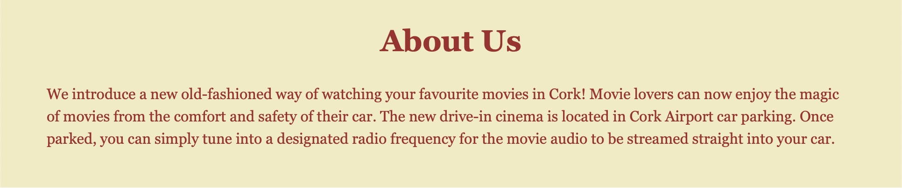
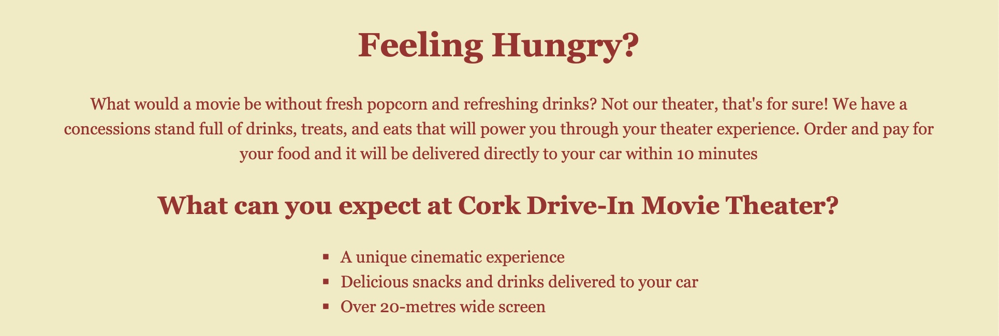

<h1>First Drive-In Movie Theater in Cork</h1>

This project introduces a website of the first drive-in movie theatre in Cork. It doesn’t exist in real life, there is no car cinema in Cork for now, but this website might be the very first step towards its implementation.

Target audience: all age groups, families with children, young adults.

The main goal of the project is to provide all information about Cork Drive-In Movie Theatre, its location, general overview, movies broadcasted etc. Through this website people can get interested in the service we offer and visit our movie theater.

<h3>Languages Used</h3>

HTML5

CSS3

<h3>Features</h3>

Responsive on all device sizes

Interactive elements

<h3>Navigation bar</h3>

Featured on all four pages, the full responsive navigation bar includes links to the Logo, Home page, Movies, FAQ and Contact Us page and is identical in each page to allow for easy navigation.

This section will allow the user to easily navigate from page to page across all devices without having to revert back to the previous page via the ‘back’ button.

<h3>Logo</h3>

The Logo at the top right corner shows the name of the movie theater, and is clickable - it redirects the user to the Home page every time they click it.

<h3>About Us section</h3>

The About Us section will allow the user to see the brief overview of the movie theater, as well as its location.

<h3>How It Works section</h3>

This section will answer the first questions the users may have, such as how the sound will be transmitted to the car, will there any seating area be available, and a need to turn off the lights before the movie starts.

<h3>Feeling Hungry section</h3>

This section will provide the users with information about food and drinks available at the cinema. It will explain how it can be ordered and delivered to the car.

This section also has a sub-section with the main benefits of the First Drive-In Movie Theater in Cork, such as a unique cinematic experience, and the biggest in Ireland over 20-metres wide screen.

<h3>The Footer</h3>

The footer section includes links to the relevant social media sites for the Movie Theater. The links will open to a new tab to allow easy navigation for the user.

The footer is valuable to the user as it encourages them to keep connected via social media.

<h3>Movies page</h3>

The second page called Movies will show the user the current movies and their schedule by days of the week. It includes movie official pictures as well.

<h3>FAQ page</h3>

The FAQ page will answer every possible question the users may have, such as where the Movie Theater located, where to buy tickets, sound, seats and food related questions. This page covers 10 most common users questions and shares the email of the Movie Theater in case the users still need assistance. The social media links at the bottom are present as well.

<h3>Contact Us</h3>

The Contact Us page invites the user to send their email through the “Email Us” section, shares the phone number and our working hours. It also invites the users to say hello on social medias, and shows how to find us on the map.

<h2>Testing</h2>

<h3>Validator testing</h3>
<h4>HTML</h4>

No errors were returned when passing through the official W3C validator

<h4>CSS</h4>

No errors were found when passing through the official (Jigsaw) validator

<h4>Lighthouse</h4>

The website was measured using Lighthouse tool, performance 100% was calculated for desktop device and 100% for mobile device:

 

<h3>Unfixed Bugs</h3>

There are no known unfixed bugs in the code

<h3>Code Used</h3>

The Code Institute student template for Gitpod was used for the site creation.
Instructions on how to use Grid CSS was taken from YouTube Tutorial https://youtu.be/_lEkD8IGkwo 

<h3>Content</h3>

The icons in the footer were taken from Font Awesome (https://fontawesome.com/) 

<h3>Media</h3>

The background image was taken from “The best date ideas in NYC” article: https://media.timeout.com/images/105659820/1372/772/image.jpg

Movie Avatar image was taken from IMDb website: https://m.media-amazon.com/images/M/MV5BMWFmYmRiYzMtMTQ4YS00NjA5LTliYTgtMmM3OTc4OGY3MTFkXkEyXkFqcGdeQXVyODk4OTc3MTY@._V1_.jpg

Movie No Exit image was taken from IMDb website: https://m.media-amazon.com/images/M/MV5BYTc4M2Q2Y2YtMjM0MS00ZTEyLWExYmMtMjEzNjlmNTNjMWYxXkEyXkFqcGdeQXVyODc0OTEyNDU@._V1_FMjpg_UX1000_.jpg

<h3>Deployment</h3>

The site is deployed using GitHub pages.
