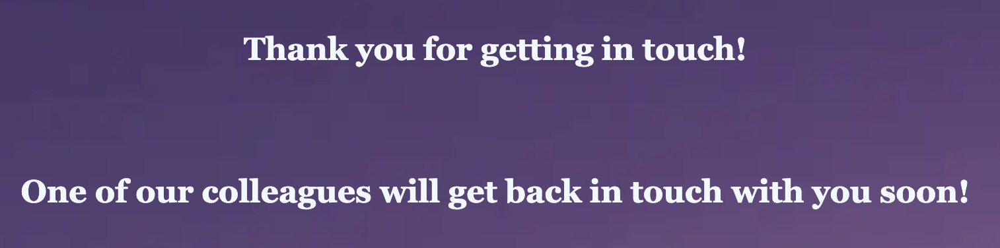

<h1>First Drive-In Movie Theater in Cork</h1>

This project introduces a website of the first drive-in movie theater in Cork. It doesn’t exist in real life, there is no car cinema in Cork for now, but this website might be the very first step towards its implementation.

Target audience: all age groups, families with children, young adults.

The main goal of the project is to provide all information about Cork Drive-In Movie Theater, its location, general overview, movies broadcasted etc. 
The main idea of the website is immediately evident to the users, i.e. the landing page shows the car cinema picture with a big screen and cars parked, and the "Welcome to the First Drive-In Movie Theater in Cork!" message.
Through this website people can get interested in the service we offer and visit our movie theater.

* [Languages Used](#languages-used)
* [Features](#features)
  * [Navigation bar](#navigation-bar)
  * [Logo](#logo)
  * [About Us section](#about-us-section)
  * [How It Works section](#how-it-works-section)
  * [Feeling Hungry section](#feeling-hungry-section)
  * [The Footer](#the-footer)
  * [Movies page](#movies-page)
  * [FAQ page](#faq-page)
  * [Contact Us](#contact-us)
* [Testing](#testing)
  * [HTML](#html)
  * [CSS](#css)
  * [Lighthouse](#lighthouse)
  * [Manual Testing](#manual-testing)
  * [Fixed Bugs](#fixed-bugs)
  * [Unfixed Bugs](#unfixed-bugs)
* [Deployment](#deployment)
  * [Cloning and forking](#cloning-and-forking)
* [Code Used](#code-used)
* [Content](#content)
* [Media](#media)

## Languages Used

HTML5

CSS3

## Features

Responsive on all device sizes

Interactive elements

  ### Navigation bar

Featured on all four pages, the full responsive navigation bar includes links to the Logo, Home page, Movies, FAQ and Contact Us page and is identical in each page to allow for easy navigation.

This section will allow the user to easily navigate from page to page across all devices without having to revert back to the previous page via the ‘back’ button.

  ### Logo

The Logo at the top right corner shows the name of the movie theater, and is clickable - it redirects the user to the Home page every time they click it.

  ### About Us section

The About Us section will allow the user to see the brief overview of the movie theater, as well as its location.

  ### How It Works section

This section will answer the first questions the users may have, such as how the sound will be transmitted to the car, will there any seating area be available, and a need to turn off the lights before the movie starts.

  ### Feeling Hungry section

This section will provide the users with information about food and drinks available at the cinema. It will explain how it can be ordered and delivered to the car.

This section also has a sub-section with the main benefits of the First Drive-In Movie Theater in Cork, such as a unique cinematic experience, and the biggest in Ireland over 20-metres wide screen.

  ### The Footer

The footer section includes links to the relevant social media sites for the Movie Theater. The links will open to a new tab to allow easy navigation for the user.

The footer is valuable to the user as it encourages them to keep connected via social media.

  ### Movies page

The second page called Movies will show the user the current movies and their schedule by days of the week. It includes movie official pictures as well.

  ### FAQ page

The FAQ page will answer every possible question the users may have, such as where the Movie Theater located, where to buy tickets, sound, seats and food related questions. This page covers 10 most common users questions and shares the email of the Movie Theater in case the users still need assistance. The social media links at the bottom are present as well.

  ### Contact Us

The Contact Us page invites the user to send their email through the “Email Us” section, shares the phone number and our working hours. 
The message form doesn't collect user's data but provides the "Thank you" message to simulate a real form. 
It also invites the users to say hello on social medias, and shows how to find us on the map.

 

## Testing

  ### HTML 

No errors were returned when passing through the official W3C validator testing

<li>Movies page: https://validator.w3.org/nu/?doc=https%3A%2F%2Fsergutin.github.io%2FDriveInMovieTheater%2Fmovies.html</li>
<li>FAQ page: https://validator.w3.org/nu/?doc=https%3A%2F%2Fsergutin.github.io%2FDriveInMovieTheater%2Ffaq.html</li>
<li>Contacts page: https://validator.w3.org/nu/?doc=https%3A%2F%2Fsergutin.github.io%2FDriveInMovieTheater%2Fcontacts.html</li>
<li>Thankyou page: https://validator.w3.org/nu/?doc=https%3A%2F%2Fsergutin.github.io%2FDriveInMovieTheater%2Fthankyou.html%3F</li>

  ### CSS 

No errors were found when passing through the official (Jigsaw) CSS validator

<li>Movies page: https://jigsaw.w3.org/css-validator/validator?uri=https%3A%2F%2Fsergutin.github.io%2FDriveInMovieTheater%2Fmovies.html&profile=css3svg&usermedium=all&warning=1&vextwarning=&lang=en</li>
<li>FAQ page: https://jigsaw.w3.org/css-validator/validator?uri=https%3A%2F%2Fsergutin.github.io%2FDriveInMovieTheater%2Ffaq.html&profile=css3svg&usermedium=all&warning=1&vextwarning=&lang=en</li>
<li>Contacts page: https://jigsaw.w3.org/css-validator/validator?uri=https%3A%2F%2Fsergutin.github.io%2FDriveInMovieTheater%2Fcontacts.html&profile=css3svg&usermedium=all&warning=1&vextwarning=&lang=en</li>
<li>Thankyou page: https://jigsaw.w3.org/css-validator/validator?uri=https%3A%2F%2Fsergutin.github.io%2FDriveInMovieTheater%2Fthankyou.html%3F&profile=css3svg&usermedium=all&warning=1&vextwarning=&lang=en</li>

  ### Lighthouse

The website was measured using Lighthouse tool, performance 100% was calculated for desktop device and 100% for mobile device:

 

  ### Manual testing

Responsiveness was tested in different browsers:

<li>Chrome</li>

<li>Safari</li>

<li>Firefox</li>

Tests were completed in following browsers from mobile device (iOS):

<li>Chrome</li>

<li>Safari</li>

No broken links found, everything works as expected.

  ### Fixed Bugs

During the project there were a few bugs and errors that have been fixed.

<ul>
<li>Error "The element "footer" must not appear as a descendant of the "header" element.</li>

Solution: "footer" has been removed out of the "header" element in HTML code, all pages.

<li>Error "Element "h2" not allowed as child of element "ul" in this context".</li>

Solution: "li" element was added within "ul", and then "h2" element within "li". Error fixed.

<li>Five "Parse errors" found while W3C CSS validator check, such as "Parse Error display: grid;", Parse Error grid-auto-flow: row;", "Parse Error }", "Parse Error gap: 1em", "Parse Error (90%, 75rem)".</li>

Solution: removed space after "min" value in line "width: min (90%, 75rem)". Grid code was rewritten afterwards without further errors.

</ul>

  ### Unfixed Bugs

There are no known unfixed bugs in the code

## Deployment

The site is deployed using GitHub Pages.

To deploy the site using GitHub Pages:

<ol>
<li>Login or signup to Github.</li>
<li>Go to the repository for this project, https://github.com/Sergutin/DriveInMovieTheater</li>
<li>At the top of the repository, locate the "Settings" button on the menu.</li>
<li>Select "Pages" section in the left hand menu.</li>
<li>From the "Source" dropdown select "Deploy from a Branch". Press "Save".</li>
<li>The site has now been deployed, please note that the process may take a few minutes before the site goes live.</li>
</ol>

  ### Cloning and forking

Forking a repository creates a copy of the original repository on GitHub account.
To fork a repository in GitHub:

<ol>
<li>On GitHub.com, navigate to the repository.</li>
<li>In the top-right corner of the page, click Fork.</li>

<li>Select an owner for the forked repository.</li>
<li>By default, forks are named the same as their parent repositories. You can change the name of the fork to distinguish it further.</li>
<li>Optionally, add a description of your fork.</li>
<li>Choose whether to copy only the default branch or all branches to the new fork. For many forking scenarios, such as contributing to open-source projects, you only need to copy the default branch. By default, only the default branch is copied.</li>
<li>Click Create fork.</li>
</ol>

Cloning a repository creates a copy of the original repository on our local machine.
To clone a repository in GitHub:

<ol>
<li>On GitHub.com, navigate to your fork of the repository.</li>
<li>Above the list of files, click  Code.</li>

<li>Copy the URL for the repository.</li>
<ul>
    <li>To clone the repository using HTTPS, click the "Copy" icon on the right of "HTTPS".</li>

<li>To clone the repository using an SSH key, including a certificate issued by your organization's SSH certificate authority, click SSH, then click the icon on the right to copy it.</li>
  <li>To clone a repository using GitHub CLI, click GitHub CLI, then click the "Copy" icon on the right.</li>
</ul>
</ol>

## Code Used

The Code Institute student template for Gitpod was used for the site creation.
Instructions on how to use Grid CSS was taken from YouTube Tutorial https://youtu.be/_lEkD8IGkwo 

## Content

The icons in the footer were taken from Font Awesome (https://fontawesome.com/) 

## Media

The background image was taken from “The best date ideas in NYC” article: https://media.timeout.com/images/105659820/1372/772/image.jpg

Movie Avatar image was taken from IMDb website: https://m.media-amazon.com/images/M/MV5BMWFmYmRiYzMtMTQ4YS00NjA5LTliYTgtMmM3OTc4OGY3MTFkXkEyXkFqcGdeQXVyODk4OTc3MTY@._V1_.jpg

Movie No Exit image was taken from IMDb website: https://m.media-amazon.com/images/M/MV5BYTc4M2Q2Y2YtMjM0MS00ZTEyLWExYmMtMjEzNjlmNTNjMWYxXkEyXkFqcGdeQXVyODc0OTEyNDU@._V1_FMjpg_UX1000_.jpg

